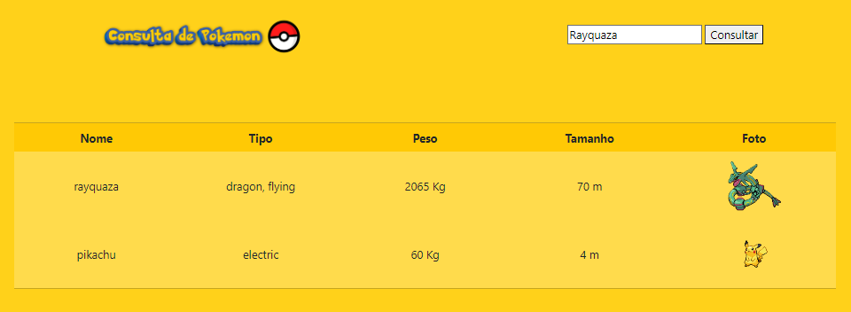

# 🔎PokéSearch

PokéSearch é uma aplicação simples para buscar informações sobre Pokémon usando a [PokéAPI](https://pokeapi.co/). Os usuários podem pesquisar por um Pokémon específico e visualizar detalhes como tipo, habilidades e aparência.

## 💻Funcionalidades

- **Pesquisa por Nome**: Os usuários podem pesquisar Pokémon pelo nome.
- **Detalhes do Pokémon**: Apresenta informações detalhadas sobre o Pokémon encontrado, incluindo nome, tipo, habilidades e aparência.

## 📸Screenshot:

## 🔧Tecnologias Utilizadas

- HTML5
- CSS3
- JavaScript (ES6+)
- [PokéAPI](https://pokeapi.co/) para obter dados dos Pokémon

## ⬇️Instalação

1. Clone o repositório: `git clone https://github.com/Kayler-Rafa/API-POKEMON.git`
2. Abra o arquivo `index.html` no seu navegador web.

## 🕹️Uso

1. Na página inicial, digite o nome de um Pokémon na caixa de pesquisa e pressione Enter ou clique no botão "Pesquisar".
2. Os detalhes do Pokémon serão exibidos abaixo da caixa de pesquisa.

## 🤝Contribuição

Contribuições são bem-vindas! Sinta-se à vontade para abrir uma issue ou enviar um pull request.

## 📧Licença

Este projeto está licenciado sob a licença MIT. Consulte o arquivo [LICENSE](LICENSE) para obter mais detalhes.

---

  This code is made by [Diniz]([link-do-seu-perfil-github](https://github.com/Kayler-Rafa)https://github.com/Kayler-Rafa)

